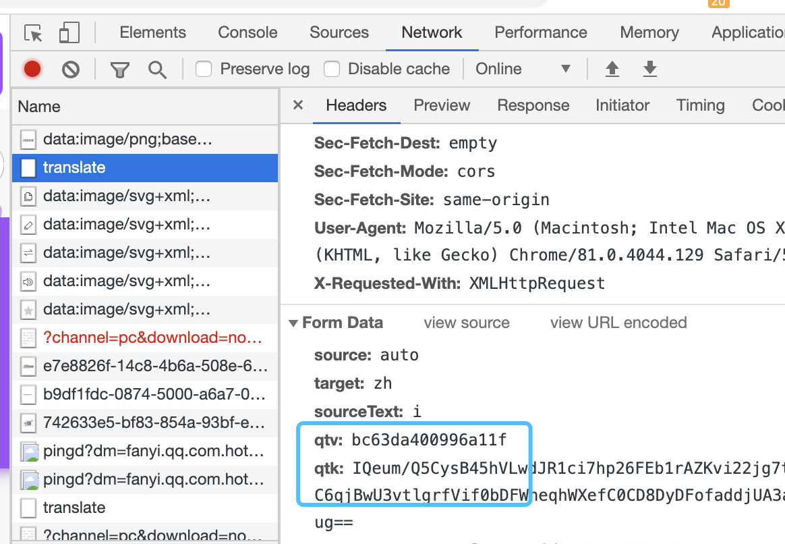

# cctool
字幕工具:
1. 翻译srt文件
2. 合并srt文件
3. 从视频生成srt文件
4. bcc 文件转srt文件

依赖[配置文件](./bin/config.yaml), 需要和程序放在同一目录

## 翻译功能
适用场景： 已经有了源语言字幕文件，但是没有目标语言字幕，这个时候可以使用翻译功能

### 设计
调用api 翻译英文到中文; 当前集成一下翻译工具:

1. 百度翻译(需要注册百度开发者，获得对应的appid和key; 成为高级开发者可以获得每秒10次的并发能力)

2. google 翻译 

3. 腾讯翻译（腾讯翻译需要填qtv 和 qtk 参数，如何获得请看faq）


### 使用
```
cctool translate -h
翻译字幕

Usage:
   translate [flags]

Flags:
  -f, --from string      源语言 (default "en")
  -h, --help             help for translate
  -m, --merge            双语字幕
  -s, --source strings   源文件
  -t, --to string        目标语言 (default "zh")
```

### 语言参数：

en : 英语

zh : 简体中文


###  使用示例
```shell script
# 单个文件
cctool translate -f en -t zh -m -s e2Engish.srt

# 批量多个文件
cctool translate -s="1.en.srt,2.en.srt" -f en -t zh -m
```

## 字幕合并
适用场景，有两个字幕文件文件，需要合并为一个字幕文件方便校对
### 策略说明
1. sequence 按照序号一一对应合并
2. timeline 按照时间轴区间合并

### 使用

```shell script
cctool merge -h
合并字幕

Usage:
   merge [flags]

Flags:
  -d, --destination string   目标文件
  -h, --help                 help for merge
  -s, --source strings       源文件
      --strategy string      merge strategy: [seq:以第一个源文件的序号主,timeline: 以第一个源文件的时间轴为主] (default "seq")
```

## 字幕转换功能
当前支持bcc 字幕转换成srt 字幕
### 使用
```shell script
cctool convert -h
转换字幕;bcc 转 srt

Usage:
   convert [flags]

Flags:
  -h, --help             help for convert
  -s, --source strings   源文件

```

## 语音识别字幕

### 设计
1. 利用ffmpeg 抽取视频中的音频
2. 使用阿里云[oss](https://www.aliyun.com/product/oss?spm=5176.12825654.eofdhaal5.13.e9392c4a8rfNXE) 或者google store 存储抽取的音频
3. 使用阿里云的[语音识别服务](https://ai.aliyun.com/nls?spm=5176.12825654.eofdhaal5.26.e9392c4a8rfNXE) 或者google speech识别获得结果
4. 输出srt 字幕

### 使用
```shell script
./cctool generate -h
生成字幕

Usage:
   generate [flags]

Flags:
  -c, --channel int      音频声道
  -h, --help             help for generate
  -s, --source strings   源文件

```

# FAQ:
Q: 使用腾讯翻译的时候 如果获取qtk， qtv

A: 打开fanyi.qq.com；按F12 调出控制台；选择网络选项卡，清空请求列表；发起一次翻译请求;在网络请求列表中找到translate；选中，点击出现的header选项卡，下拉找到qtv，qtk值


